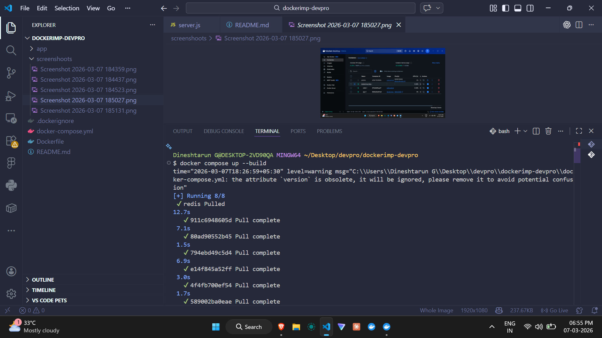

# Dockerized URL Shortener

A containerized URL shortening service built using Node.js and Redis, deployed using Docker and Docker Compose.

---

## Tech Stack

Node.js  
Express.js  
Redis  
Docker  
Docker Compose  

---

## Architecture

Client → Node.js API → Redis Database

---

## Project Structure

Dockerimp-devpro
│
├── app
│   ├── server.js
│   └── package.json
│
├── Dockerfile
├── docker-compose.yml
└── screenshots

## Application Screenshots

Docker Build

Running Containers

API Test

How to Run the Project
git clone https://github.com/yourusername/dockerized-url-shortener.git

cd dockerized-url-shortener

docker compose up --build

Docker Hub Image
docker pull tarun08/url-shortener

Features

  - URL shortening API

  - Redis based storage

  - Containerized with Docker

  - Multi-container setup using Docker Compose# Docker-url-shortner-devpro
